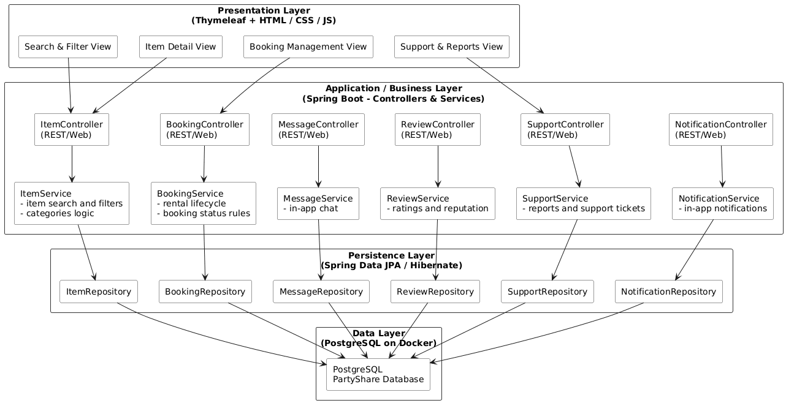

# 4. System Architecture

## 4.1 Layered Architecture Overview

<!-- Insert Architecture Diagram Here -->

 

## Presentation Layer (Thymeleaf + HTML/CSS/JS)

The presentation layer is implemented using **Thymeleaf templates** rendered by Spring Boot, combined with standard **HTML**, **CSS**, and a small amount of **JavaScript** for basic client-side interactions.

This layer provides the main views for:

- searching and filtering items  
- viewing detailed item information  
- managing bookings  
- accessing support pages  

All user-facing actions eventually call controllers in the application layer, maintaining a clean separation between UI and business logic.

 

## Application / Business Layer (Spring Boot Controllers & Services)

The application layer is developed using **Spring Boot**.  
REST/Web controllers are responsible for handling incoming HTTP requests and delegating work to service classes.

Each main domain has its own controller–service pair:

- Items  
- Bookings  
- Messaging  
- Reviews  
- Support  
- Notifications  

This layer contains all **core business rules**, such as:

- booking status transitions  
- rental date validation  
- reputation score calculations  
- creation of in-app notifications  

It acts as the central orchestrator of the system’s behavior.

 

## Persistence Layer (Spring Data JPA / Hibernate)

The persistence layer uses **Spring Data JPA** and **Hibernate** to interact with the relational database.

Every domain aggregate has an associated repository interface:

- Items  
- Bookings  
- Messages  
- Reviews  
- Support Tickets  
- Notifications  

Service classes use these repositories for all read/write operations.  
No SQL code is exposed in higher layers, ensuring better encapsulation and maintainability.

 

## Data Layer (PostgreSQL on Docker)

The data layer consists of a **PostgreSQL** relational database running inside a **Docker** container.

All system data is stored here:

- users  
- items  
- categories  
- bookings  
- chat messages  
- reviews  
- support tickets  
- notifications  

Spring Boot connects to PostgreSQL via **JPA/Hibernate**, and the environment is fully reproducible through **Docker Compose**, supporting consistent development, staging, and deployment environments.

 

---

